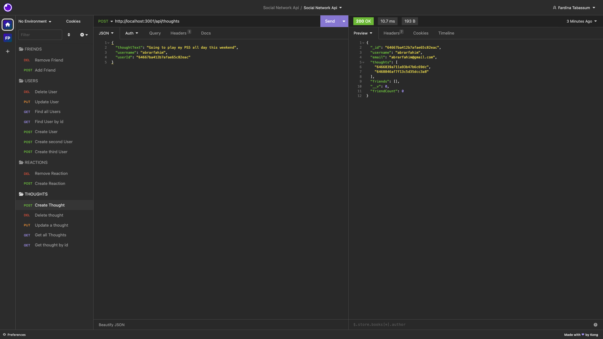

# Challenge-18-Social-Network-API
This repository contains the code used to make an API for a social network web application using Express, MongoDb and Mongoose.

## Description
The purpose of creating this Social Network API is to allow a social media startup company to be able to build a website that can manage large amounts of data using a NoSQL database. This API MongoDB to store data and uses routes to allows users to view available users and also let them create new users with further routes to allow them to update and delete users. The users can also POST,GET, UPDATE and DELETE thoughts. They can also add and remove other users as friends. Finally the api also allows users to create reactions to other user's thought and even allow then to delete their reactions. This api also uses the Mongoose models to create various schemas and connect them to the database.

## Installation

### Link to video demo: https://drive.google.com/file/d/1UOMu1seAlOrxK7pFU8JERBEAgvNs2xl4/view

Git clone the repository and then on the terminal install the necessary packages using nmp install including express and Mongoose packages. Install the following packages by using the code below.


```
npm i
```

Afer all the necessary packages have been installed, start the API using the following code
```
npm start
```
Users can then open up the appropriate port link in platforms such as insomnia or postman  (http://localhost:3001/) followed  by the approprite routes to send various http requests.

## Usage



The images folder contains a screenshot of all the http requests that can be made using insomnia. The config folder contains the connection.js file used to connect to the mongo database. The controllers folder contains the thought-controller.js and user-controller.js which is used to create functions for all the route requests. The models folder contains the schema used to make the user and thought and reaction models. The utils folder contains the date.Format.js used to make time stamps for the thoguht and reactions requests and convert them to a readable format. Finally, the routes folder conatins the different routes used to fetch the requests.

## License

Uses the MIT License
# [](https://opensource.org/licenses/MIT)